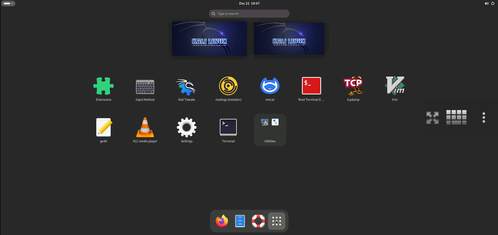
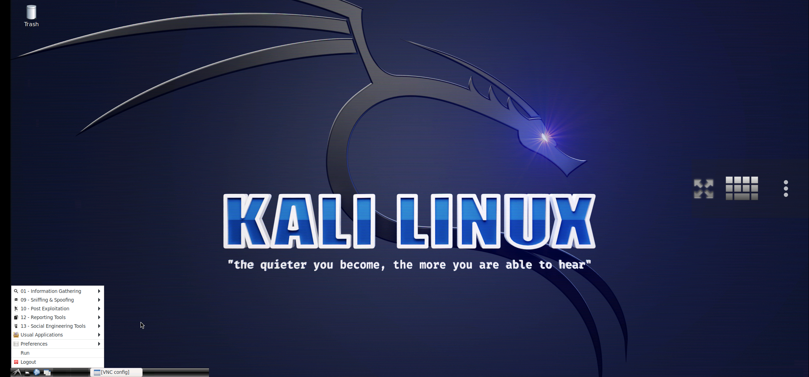
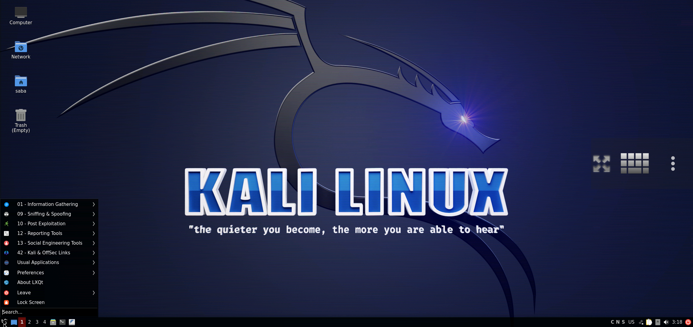
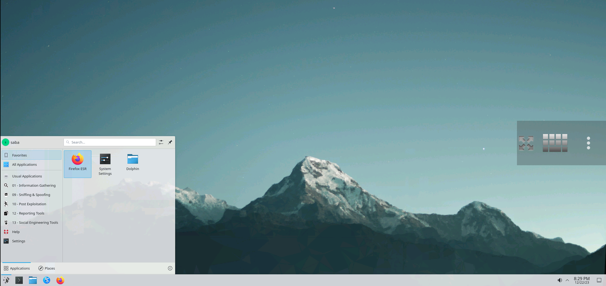

<b>Easily Install Full Kali Linux Verious Type Of Desktop in Termux</b>

### FEATURE:

- :speaker: Fixed Audio Output
- :globe_with_meridians: 2 Browsers (Chromium & Mozilla Firefox)
- :tv: VLC Media Player and MPV media player (VLC Fully work)
- :books: Easy for Beginners
- :computer: Add new Application Menu
- :hammer: Install XFCE, LXDE, LXQT, KDE, or GNOME Desktop
- :art: More customization (new styles added and new fonts etc...)

### INSTALLATION:

1. Firstly install [Termux](https://termux.com) apk from [HERE](https://f-droid.org/repo/com.termux_118.apk)
2. Secondly Clone the Repository & Run the setup File

   - `pkg update -y && pkg upgrade -y`
   - `pkg install wget -y`
   - `wget https://raw.githubusercontent.com/sabamdarif/modded-kali/main/setup.sh`
   - `chmod +x setup.sh`
   - `bash setup.sh`
   - `kali`
   - `bash gui.sh`
   - Now select **KFCE**, **KDE**, **LXDE**, **LXQT** OR **GNOME** Desktop (any one)

### DEMO IMAGES:

 

<b><code>Xfce Desktop</code></b>

 

<b><code>Gnome Desktop</code></b>

 

<b><code>Lxde Desktop</code></b>

 

<b><code>Lxqt Desktop</code></b>

 

<b><code>Kde Desktop</code></b>

3. **You have to note your VNC password !!**
4. **If you select xfce4 / default desktop environment then you need to run `./customize-my-desktop`**
5. KALI image is now successfully installed.

   - Type `vncstart` to run Vncserver
   - Type `vncstop` to stop Vncserver

6. Install VNC VIEWER Apk on your Device. [Google Play Store](https://play.google.com/store/apps/details?id=com.realvnc.viewer.android&hl=en)
7. Or, Install NetHunter KeX from [Nethunter Store](https://store.nethunter.com/en/packages/com.offsec.nethunter.kex/)
8. Open VNC VIEWER & Click on + Button & Enter the Address `localhost:1` & Name anything you like
9. Set the Picture Quality to High for better Quality
10. Click on Connect & Input the Password
11. Install [Termux:x11](https://github.com/termux/termux-x11/releases)
12. Enjoy :smile:

### NOTE:

- **Type `kali` to run KALI CLI as noraml user**
- **Type `kali -r` to run KALI CLI as root user**
- **Type `vncstart` to run Vncserver**
- **Type `vncstop` to stop Vncserver**
- **Type `vncstop -f` to stop Vncserver forcefully**
- **Type `kali -tx11start` to Start The Desktop Using Termux:x11**
- **Type `kali -tx11stop` to Stop Termux:x11**
- **Type `bash remove.sh` to remove KALI**

### ISSUES:
- **Issue:-** Vnc server related issue like *vnc autostop* , *Apps not showing*
- **Solution:-** Login into root user using `kali -r` then launch vncserver

### If you like our work then dont forget to give a Star :)

