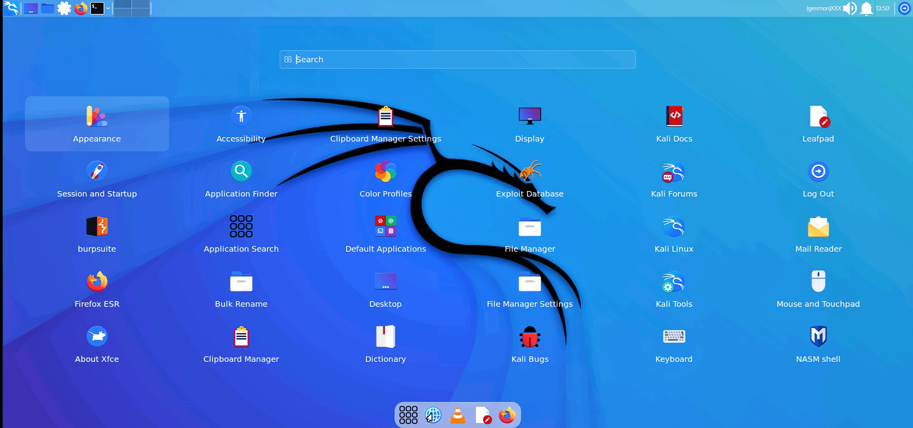

<b>Easily Install Full Kali Linux Desktop in Termux</b>

### Features:

- Fixed Audio Output
- 2 Browsers (Chromium & Mozilla Firefox)
- VLC Media Player and MPV media player (VLC Fully work)
- Easy for Beginners
- Add new Application Menu
- Instal XFCE,LXDE,LXQT,KDE or GENOME Desktop 
- More customization ( new styles added and new fonts etc... )

### Installation:

- Firstly install [Termux](https://termux.com) apk from [HERE](https://f-droid.org/repo/com.termux_118.apk)
- Secondly Clone the Repository & Run the setup File

  - `pkg update -y && pkg upgrade -y`
  - `pkg install git wget -y`
  - `git clone https://github.com/sabamdarif/modded-kali`
  - `cd modded-kali`
  - `bash setup.sh`
  - `kali`
  - `bash gui.sh`
  - Now select **KFCE**,**KDE**,**LXDE**,**LXQT** OR **GNOME** Desktop (any one)
- **You have to note your VNC password !!**
- **If you select xfce4 / defult desktop environment then you need to run `./customize-my-desktop`**
- KALI image is now successfully installed .

  - Type `vncstart` to run Vncserver
  - Type `vncstop` to stop Vncserver

- Install VNC VIEWER Apk on your Device. [Google Play Store](https://play.google.com/store/apps/details?id=com.realvnc.viewer.android&hl=en)
- Or, Install NetHunter KeX from [ Nethunter Store ](https://store.nethunter.com/en/packages/com.offsec.nethunter.kex/)

- Open VNC VIEWER & Click on + Button & Enter the Address `localhost:1` & Name anything you like
- Set the Picture Quality to High for better Quality
- Click on Connect & Input the Password 
- Enjoy :D

### NOTE :

- **Type `kali` to run KALI CLI.**
- **Type `vncstart` to run Vncserver**
- **Type `vncstop` to stop Vncserver**
- **Type `fixvnc` if the vnc server not started (for Android 12 users)**
- **Type `bash remove.sh` to remove KALI**

### ISSUES:
- **Issue:-** Android 12 users have a problem of vncserver automatically stop and and show " [Process completed (signal 9) - press Enter] " &  the next time vncserver not starting

- **Solution:-** *use command `fixvnc` and the server started again*

### If you like our work then dont forget to give a Star :)

